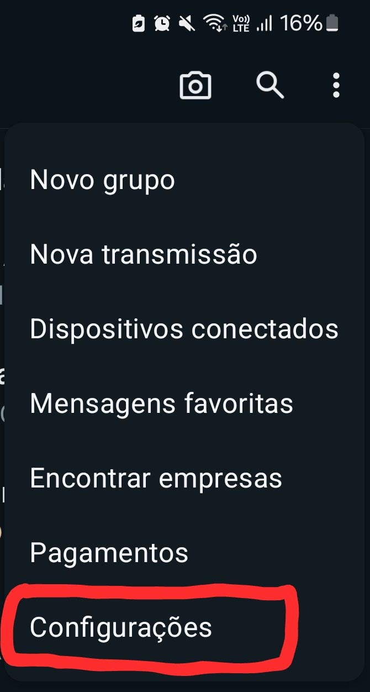
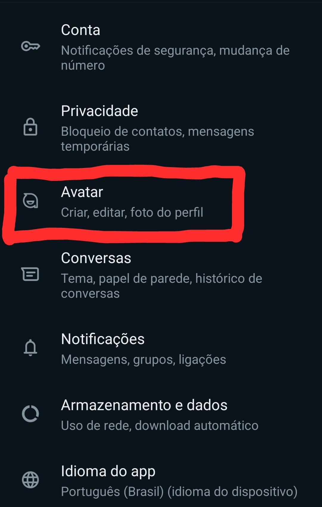
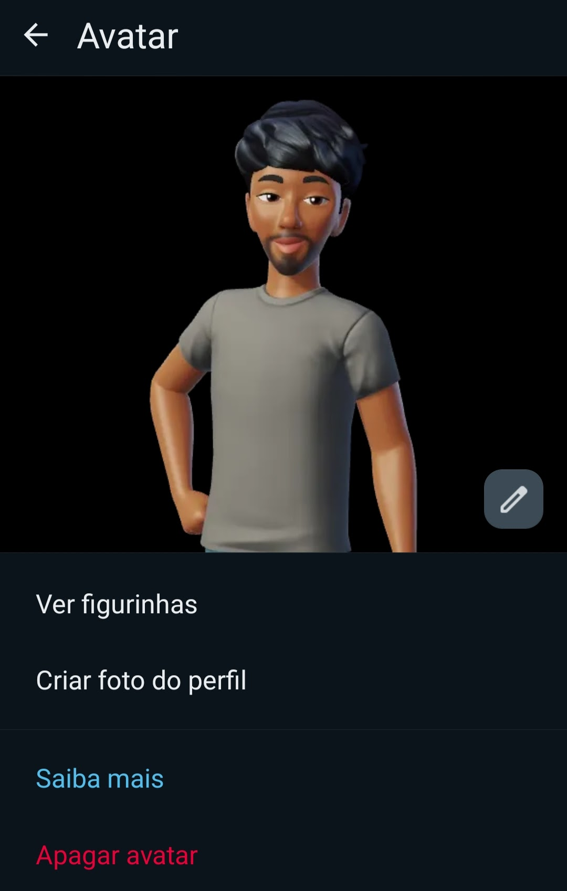
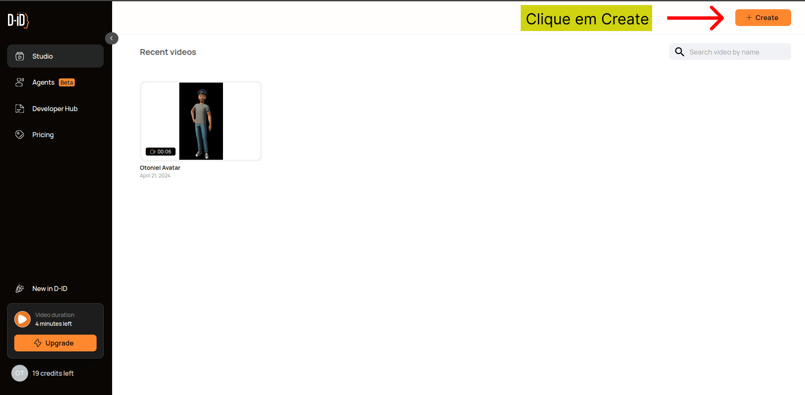
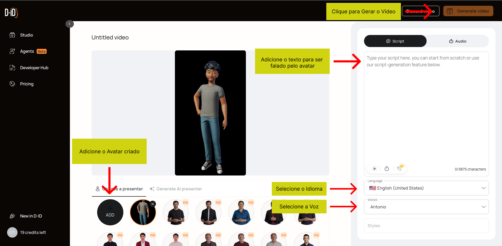
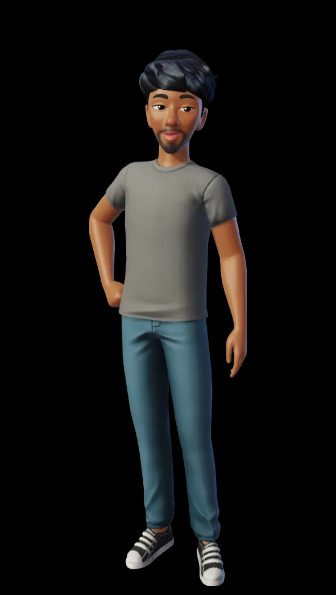

# Lab-Natty-Or-Not

# Avatar Otoniel 

## 📒 Descrição
Um Avatar meu criado através do WhatsApp falando um pequeno texto.

## 🤖 Tecnologias Utilizadas
- [WhatsApp](https://web.whatsapp.com/)
- [D-ID](https://www.d-id.com/)

## 🧐 Processo de Criação
- Criar avatar no WhatsApp
    1. entre nas configurações do WhatsApp
    
    
    2. entre na Opção `Avatar`
    
    
    3. Crie o seu Avatar
    

- Criar video no D-ID
    1. entre nas configurações do WhatsApp
    
    
    2. entre na Opção `Avatar`
    

## 🚀 Resultados (Clique na imagem para ver o video)

